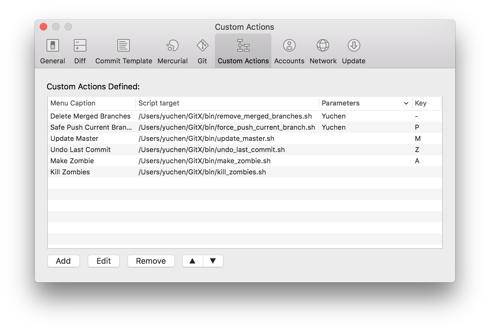
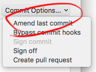

# Source Tree Custom Actions

This [GitHub repo](https://github.com/yzhong52/GitX) constains a list of useful source tree. Building with existing git command, it extends the source tree functionalities. For example, you can keep the git repo clean with **delete merged branches**; and you can **undo last commit** if you made a mistake. 

To use the custom actions here, simply clone the repo on your computer. Open Preferences by <kbd>⌘</kbd> + <kbd>,</kbd> and then click on the "Custom Actions" tab:

From there you can "Add", "Edit" or "Remove" custom actions for source tree.

Type in whatever you want in the Menu Caption. It is recomended to select the check boxes of both "Open in Separate Window" and "Show Full Output" so that it is easier to capture errors if there is one. 

Ane here comes all the available actions in this repo:

## Delete Merged Branches

Delete all branches that are merged to **current** branch, **master** branch, **dev** branch or **develop** branch. By default, this script only delete removed branches locally. If we want to also remove the merged branch in the remote, we can pass in the remote name as parameter.

* Script: `delete_removed_branches.sh`
* Suggested shortcut: <kbd>fn</kbd> + <kbd>-</kbd>
* Parameter: remote name (optional)

## Make Zombie Branch

Rename the current branch to `zombie/YYYY-MMM-DD/HH-MM-SS/{Current Branch Name}`. The idea is to archive a branch instead of deleting it. It is nicer to put the branches in folder start with letter "z" instead of "a" (archive) because Source Tree will order the branches by lexical order. 

* Script: `make_zombie.sh`
* Suggested shortcut: <kbd>fn</kbd> + <kbd>A</kbd>

## Kill Zombies

Zombie branches that are older than 2 months will be deleted. 

* Script: `kill_zombies.sh`

## Force Push Current Branch To Remote

You can enable force push from source tree directly. 

On one hand, force push is consider a dangerous operation since it will overwrite the history in the remote; on the other hand, force push is a good tool to keep your commit history clean. This feature is useful when being used along with `git amend`. 

By default, this script will push to orign remote. But you can specify your remote name in the parameter. 

* Script: `force_push_current_branch.sh`
* Parameter: remote name (optional)
* Suggested shortcut: <kbd>fn</kbd> + <kbd>F</kbd>

## Undo Last Commit

Sometime we need to switch to a different branch to check some code, with a colleague for example. Howeve, you cannot do that if you have some uncommited changes. With this script, you can make a dummy commit just to save the WIP changes. And when you come back to this branch, you can simply undo the last commit. 

Just in case we call this script by mistake, the script will make a archive (or zombie) before undoing the last commit so that we won't lost any commit message by accident.

You can call this script multiple time to undo multiple commits.

* Script: `undo_last_commit.sh`
* Suggested shortcut: <kbd>fn</kbd> + <kbd>Z</kbd>
